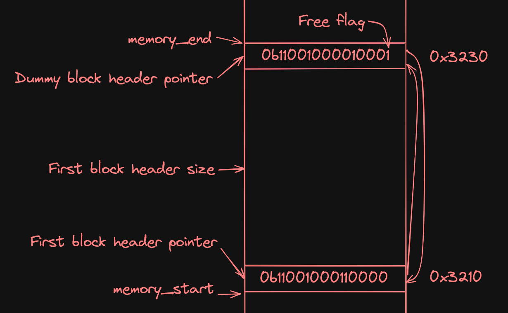

# Task 1
1.
Bit 0 is the least significant because it tells us whether or not the address is odd or even, and since we want the addresses to be 8-byte aligned, it becomes irrelevant because it will always be 0 (even). In fact the six bits from the right are all irrelvant because all of them add less than 64 bit (8-byte) to the final sum of bit, which are the only ones we care about.

2.

3.
The prefix 0x is used to indicate that the addresses are written in hexadecimal. The charaters in hexadecimal represents the a number between 0-16 multiplied with $16^n$ where $n$ is the position of the character starting from index 0 at the right-most side. This means that the character to the right represents a number between 0-16, since $16^0$ cancels out. All the following characters will always be a multiplication of 16 which is just $2*8$, so it's only the first (right-most) character that can determine whether or not the address is 8-byte aligned. So in the case of 0x100 and 0x180...

4.

5.

# Task 2
1. Explain on of your macros in detail.
2. Give a brief account of those implementation parts that you have found most challenging.
3. Device a test (extending the given check-based test suite) that demonstrates the the
memory management system does not use a first fit strategy.
State the code of your test in the report and explain how it works

# Task 3
1. State the result of the combined system. Does it still work?
2. Discuss what will happen if the user program forgets to free allocated collection nodes.
What is the phenomenon called?
3. Another common problem with explicit memory management is the notion of dangling
pointers. Explain this notion briefly.
4. Suggest a measure which could be implemented in the memory management system in
order to help detecting occurrences of dangling pointers.

note: we changed some things according to your last feedback
